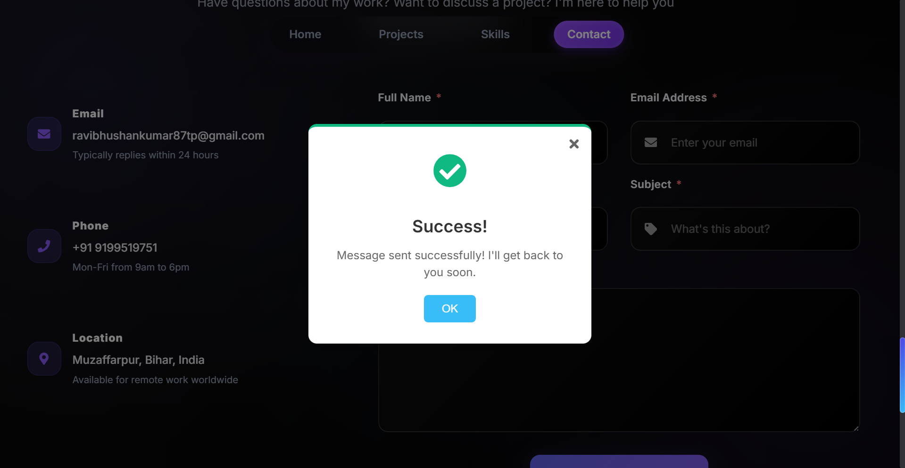

# 🌟 Personal Portfolio

A modern, full-stack personal portfolio website with admin dashboard for dynamic content management. Built with the MERN stack, featuring AWS S3 integration for media storage and CloudFront for optimized content delivery.

## 📸 Screenshots
<table align="center">
  <tr>
    <td align="center">
      <br/>
      <em>Home Page</em>
    </td>
    <td align="center">
      <br/>
      <em>Projects section</em>
    </td>
  </tr>

  <tr>
    <td align="center">
      <br/>
      <em>View details section</em>
    </td>
    <td align="center">
      <br/>
      <em>View details section</em>
    </td>
  </tr>

  <tr>
    <td align="center">
      <br/>
      <em>Skills section</em>
    </td>
     <td align="center">
      <br/>
      <em>Contact section</em>
    </td>
  </tr>
   <tr>
    <td align="center">
      <br/>
      <em>Admin login</em>
    </td>
     <td align="center">
      <br/>
      <em>Admin dashboard</em>
    </td>
  </tr>
   <tr>
    <td align="center">
      <br/>
      <em>Admin dashboard</em>
    </td>
     <td align="center">
      <br/>
      <em>Admin dashboard</em>
    </td>
  </tr>
</table>


## [Live Demo](https://ravibhushan-portfolio.vercel.app)

## 🌟 Features

### 🎨 **Modern UI/UX**
- Clean and professional interface
- Smooth animations and transitions
- Responsive design for all devices
- Dark theme with elegant color scheme
- Optimized user experience

### 📱 **Portfolio Sections**
- Home section with introduction
- Skills showcase with technology stack
- Dynamic projects portfolio with live demos
- Professional experience timeline
- Contact information and social links
- Downloadable resume

### 🔐 **Admin Dashboard**
- Password-protected admin panel
- Project management (Add/Edit/Delete)
- Real-time content updates
- Image and resume upload
- Project preview before publishing

### 💾 **Content Management**
- Add new projects with details
- Update existing project information
- Delete outdated projects
- Upload project images to AWS S3
- Manage resume file
- Real-time portfolio updates

### ☁️ **Cloud Integration**
- AWS S3 for secure file storage
- CloudFront CDN for fast content delivery
- Optimized image loading
- Resume file hosting
- Scalable media management

### 🚀 **Technical Excellence**
- RESTful API architecture
- MongoDB database integration
- Environment-based configuration
- Production-ready deployment

## 🛠️ Technologies Used

### Frontend (Client)
| Technology | Purpose | Version |
|------------|---------|---------|
| React | UI Framework | 18+ |
| React Router | Navigation | Latest |
| Vite | Build Tool | Latest |
| CSS3 | Styling & Animations | - |
| JavaScript (ES6+) | Programming Language | - |


### Backend (Server)
| Technology | Purpose | Version |
|------------|---------|---------|
| Node.js | Runtime Environment | 16+ |
| Express.js | Web Framework | Latest |
| MongoDB | Database | Latest |
| Mongoose | ODM | Latest |
| JWT | Authentication | Latest |
| AWS SDK | S3 Integration | Latest |

### Cloud & Storage
| Service | Purpose |
|---------|---------|
| AWS S3 | File Storage |
| CloudFront | CDN & Content Delivery |
| MongoDB Atlas | Database Hosting |

### DevOps & Tools
| Tool | Purpose |
|------|---------|
| Vercel | Frontend Deployment |
| Git | Version Control |
| npm | Package Management |
| Postman | API Testing |

## 🚀 Getting Started

### Prerequisites
- Node.js (v16 or higher)
- MongoDB (local or Atlas)
- AWS Account (for S3 and CloudFront)

### Installation Steps

1. **Clone the repository**
   ```bash
   git clone https://github.com/ravibhushan10/Portfolio.git
   cd Portfolio
   ```

2. **Install Client Dependencies**
   ```bash
   cd client
   npm install
   ```

3. **Install Server Dependencies**
   ```bash
   cd ../server
   npm install
   ```

4. **Client Environment Variables: Create `.env` file in `client/` root directory**
   ```env
   VITE_API_URL="your backend url"
   VITE_ADMIN_PASSWORD="your admin password"
   ```

5. **Server Environment Variables: Create `.env` file in `server/` root directory**
   ```env
   PORT="port number"
   MONGO_URI="Database url"
   NODE_ENV="Development or production according to use"
   ```

6. **Start the Server**
   ```bash
   cd server
   npm start
   Server will run on http://localhost:5000
   ```

7. **Start the Client** (in a new terminal)
   ```bash
   cd client
   npm run dev
   Client will run on http://localhost:5173
   ```

## 📖 Usage Guide

### For Visitors

1. **Browse Portfolio**
   - View projects and skills
   - Download resume
   - Contact via social links

### For Admin

1. **Admin Login**
   - Navigate to `vercel.app/admin`
   - Enter admin password
   - Access dashboard

2. **Dashboard**
   - View all projects
   - Manage portfolio content
   - Upload new media

3. **Add New Project**
   - Click "Add Project" button
   - Fill in project details
   - Upload project images
   - Add technology stack
   - Include live demo and GitHub links
   - Save and publish

4. **Edit Project**
   - Select project to edit
   - Update any information
   - Replace images if needed
   - Save changes

5. **Delete Project**
   - Select project to delete
   - Confirm deletion
   - Project removed from portfolio
     

## 🤝 Contributing

### How to Contribute

1. **Fork the Repository**
   - Click the 'Fork' button at the top right of this repository
   - This creates a copy of the project in your GitHub account

2. **Clone Your Fork**
   ```bash
   git clone https://github.com/YOUR-USERNAME/Portfolio.git
   cd Portfolio
   ```

3. **Create a Branch**
   ```bash
   git checkout -b feature/AmazingFeature
   ```

4. **Make Your Changes**
   - Write clean, readable code
   - Follow the existing code style
   - Test your changes thoroughly

5. **Commit Your Changes**
   ```bash
   git add .
   git commit -m 'Add some AmazingFeature'
   ```

6. **Push to Your Fork**
   ```bash
   git push origin feature/AmazingFeature
   ```

7. **Open a Pull Request**
   - Go to your forked repository on GitHub
   - Click **"Compare & pull request"**
   - Fill in the PR form:
     - **Title**: Brief summary (e.g., "Add password strength indicator")
     - **Description**: Explain your changes clearly:
       - What changes you made
       - Why you made them
       - Screenshots (if UI changes)
       - Related issue numbers (e.g., "Fixes #123")
   - Click **"Create pull request"**
   - Wait for review and be responsive to feedback

## 👨‍💻 Author
**Ravi Bhushan**
- LinkedIn: [https://www.linkedin.com/in/ravibhushan-kumar-55b312344](https://www.linkedin.com/in/ravibhushan-kumar-55b312344/)
- Portfolio: [https://ravibhushan-portfolio.vercel.app](https://ravibhushan-portfolio.vercel.app)
- GitHub: [@ravibhushan10](https://github.com/ravibhushan10)
- Email: ravibhushankumar87tp@gmail.com

---
<div align="center">
   
### ⭐ Star this repository if it helped you!
**Made with ❤️ by Ravi Bhushan**
   
   
[Live Demo](https://ravibhushan-portfolio.vercel.app) · [Report Bug](https://github.com/ravibhushan10/Portfolio/issues) · [Request Feature](https://github.com/ravibhushan10/Portfolio/issues)

</div>

---


